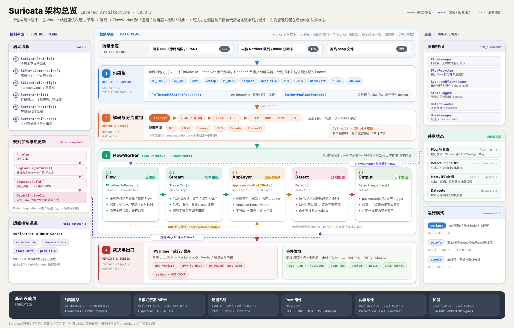

# Suricata 源码阅读(零)：一个数据包如何穿过 Suricata

Suricata 是一个开源的网络威胁检测引擎。它实时读取网络流量，拿规则库去匹配，常见用法有三种：当 IDS，只告警不拦截；内联部署当 IPS，直接拦下恶意流量；或者当 NSM，把协议元数据和文件记下来，留给事后分析。

名字来自非洲草原上的猫鼬(学名 *Suricata suricatta*)。猫鼬群居，总有几只直立放哨，一有风吹草动就尖声报警。2009 年，OISF(Open Information Security Foundation)用这个名字做了一个开源、多线程的 IDS/IPS 引擎，想在当时基本单线程的 Snort 之外，提供另一个选择。名字挑得很贴切：这个引擎做的也是放哨——盯着每一个包，一有可疑动静就报警。

它具体是怎么盯的？最直接的办法，是跟着一个包走一遍：它从网卡进来，被谁接住，在哪一步变成 `Packet`，什么时候和别的包归进同一个 `Flow`，TCP 重组归谁管，最后又怎么变成一条 EVE JSON 告警？还有规则：几万条规则同时加载，引擎怎么还跟得上流量？

这些问题，配置手册回答不了。手册教你怎么用这台机器，不讲机器里的齿轮怎么咬合。答案藏在 Suricata 的线程、队列、状态机，以及那些名字不太直观的 C 结构体里。

所以这个系列不讲规则怎么写、`suricata.yaml` 怎么调、怎么部署上线，只讲原理：这套引擎自己是怎么实现的，一个包在源码里究竟经过了哪些函数、数据结构和状态机。

把 Suricata 想象成一条工厂流水线：包从网卡或 pcap 文件进来，依次经过捕获、解码、Flow、Stream、应用层解析、规则检测这几道工位，最后由输出模块写成日志。先给这条产线画一张图：

这张图只画了主干。把配套的子系统也画上，整个引擎长这样——之后每一篇都是把其中一块拆开来细看：

流水线开工之前，得先有人把它搭起来：第1篇看进程启动时，线程和模块是怎么一步步准备好的；第2篇再看 `TmModule` 怎么把它们串成一条能跑的流水线。

这是一份源码阅读记录，也是一张逐步画出来的地图。我会沿着一个包的生命周期往前走，每一篇尽量落到具体的函数、数据结构和代码位置，不把源码阅读写成概念名词的目录——真正想弄明白的是，一个成熟的开源检测引擎，是怎样把网络世界里持续到来的字节，组织成可以处理、可以匹配、可以解释的事件。

如果你有 C 基础，对网络协议栈不算陌生，又想知道一个真实的安全引擎内部是怎么运转的——这份地图适合你。不用一次记住所有细节。先在源码里认出路，再慢慢看懂每个路口为什么这样设计，就够了。

## 我打算怎么读

Suricata 的 `src/` 目录有上千个文件、几十万行代码，一开始就想"通读"基本等于劝退自己——像是站在一座陌生工厂门口，想靠一份零件清单搞懂整条产线怎么运转。所以这个系列不按目录结构走，而是跟着一个包实际走过的顺序走——先问"这一步在流水线的哪个工位"，再去看对应目录下的代码，而不是反过来从文件名倒推它是干什么的。

每一篇只挖一条主线，遇到旁支细节(比如某个协议的边界情况、某个参数的调优选项)会先记下来，不在当篇展开，避免一篇文章塞进两三个话题。同时尽量落到具体的 `文件:行号`，方便你对照源码验证我说得对不对——源码阅读最怕的就是"感觉理解了"却经不起追问。本系列基于 Suricata 8.0.7(tag `suricata-8.0.7`)，文中行号都以这个版本为准。

## 系列篇目

1. **启动一个 Suricata 进程，到底要经过多少步？** —— 从 `main()` 到第一个包被处理之前，进程先把哪些东西搭起来？先把全局地图画出来。[已发布]
2. **一条流水线是怎么跑起来的：线程模型与 TmModule** —— `TmModule` 和 `ThreadVars` 如何把各个处理阶段串起来？single、autofp、workers 三种模式，到底差在哪里？[已发布]
3. **包是怎么进来的：捕获模块与 Packet 结构体** —— AF_PACKET、PCAP、NFQ 抓到的都只是原始字节，它们如何把一个包交给引擎？`Packet` 又为什么不只是一个普通结构体？
4. **把字节剥成协议：解码层** —— 从以太网到 IP，再到 TCP，一层层拆开的过程并不只是"取几个字段"。畸形包、隧道和边界情况，会在这里露出真面目。
5. **引擎开始记住事情：Flow** —— 单个包很快就过去了，`Flow` 才让 Suricata 记住一段通信。流表怎么查找、什么时候过期、谁来回收，这里是理解后续模块的关键。
6. **TCP 重组为什么这么难：Stream 引擎** —— 乱序、重传、gap，还有专门用来绕过检测的 evasion。看似只是把 TCP 段拼起来，实际上是一场持续处理不确定性的状态机游戏。
7. **从端口到协议：应用层解析框架** —— Suricata 怎么判断眼前是 HTTP、TLS 还是别的协议？以 probing parser 和 HTTP 为例，走一遍解析器被发现、注册和调用的完整路径。
8. **规则还没开始匹配：检测引擎如何把文本变成结构** —— 一行规则加载之后，会被拆成什么？`Signature`、`SigMatch` 这些结构，如何把规则描述转换成可执行的检测条件？
9. **几万条规则一起跑：多模式匹配与规则分组** —— 规则数量上来之后，逐条检查显然行不通。MPM 和签名分组(SGH)如何把搜索空间压下来，让检测引擎仍然有机会跑到线速？
10. **命中之后发生什么：从规则匹配到一行 JSON** —— 一条告警不是凭空写进日志的。`output` 模块如何注册，事件如何一路传到 EVE，最后又怎样变成我们看到的 JSON？

顺序可能会随着源码阅读的进展微调，但这条主线不会变：先跟着一个包走一遍，再回头拆开它经过的每个模块。

下一篇，从 `main()` 开始：一个 Suricata 进程在处理第一个包之前，先把哪些东西搭了起来？
