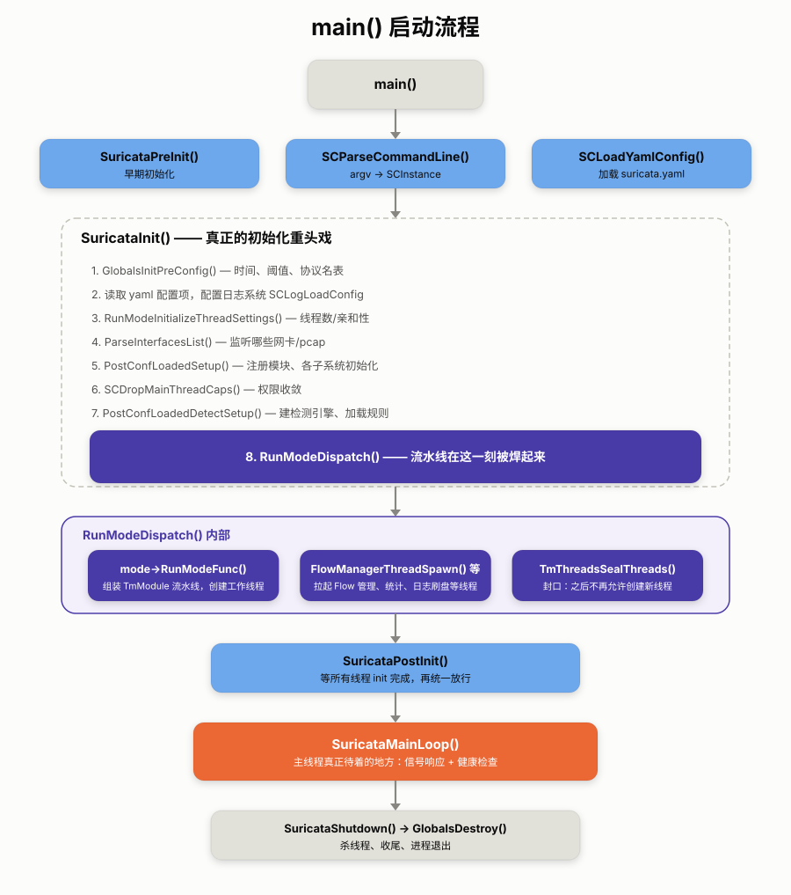
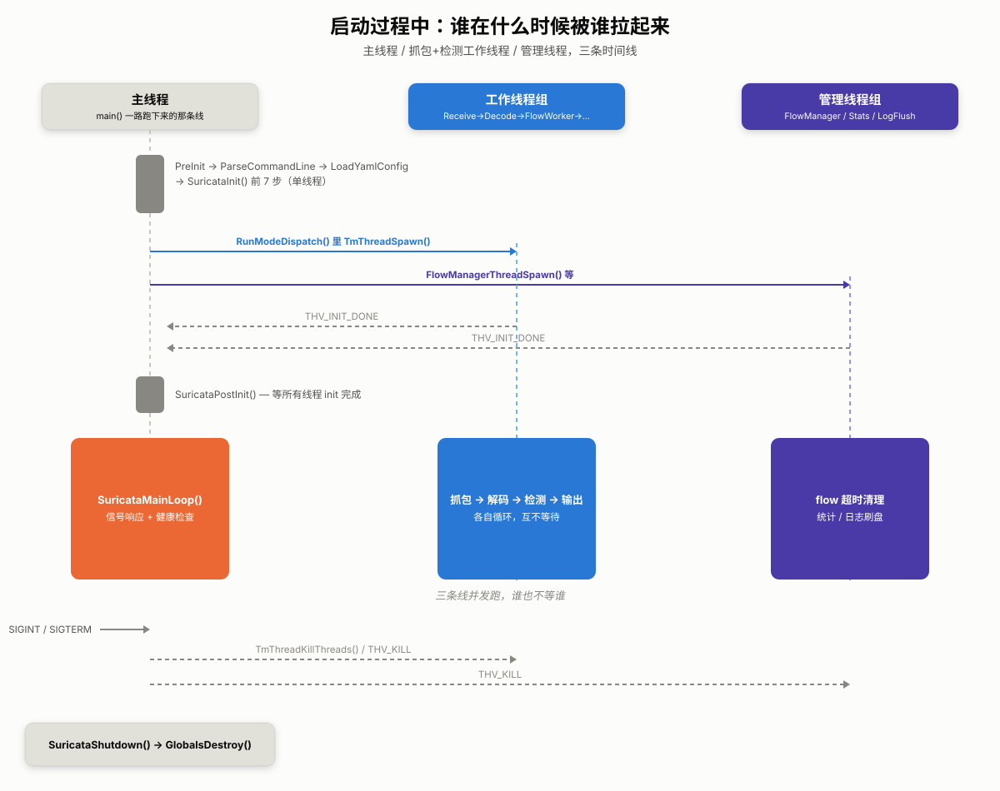

# Suricata 源码阅读(一)：启动一个 Suricata 进程，到底要经过多少步？

> 这是系列第 1 篇。我们先不急着钻进某个协议解析器，也不急着看规则是怎么匹配的。先跟着 Suricata 启动一遍，看看它如何从命令行参数和配置文件，一路走到真正可以接收数据包的状态。后面每篇文章，都会回到这张地图上的某个位置继续往下挖。

## 1. 先看一眼：这个引擎准备怎么工作

把 Suricata 想象成一条工厂流水线：网卡或者 pcap 文件是原料入口，每一个包从这里进来，依次经过一道道工位——捕获 → 解码 → 流跟踪 → TCP 重组 → 应用层解析 → 规则检测 → 输出，最后变成一条告警从流水线尽头掉出来。每道工位是一个可插拔的模块，若干个工位串成一条线，挂在一个或多个线程(也就是"工人")身上跑。

这个比喻值得记住，因为它决定了我们接下来读源码的姿势。看到一个函数，先问它站在流水线的哪个工位上;看到一个线程，再问它身兼几道工位。这样读下去，`src/` 里几百个文件就不再是名字的乱码，而是一张可以顺着走的车间地图。

对应到源码里，这条流水线靠两个核心概念撑起来：

- **TmModule**(Thread Module)：一个工位的抽象，定义在 `src/tm-modules.h:47`。本质是一组函数指针(`ThreadInit`/`Func`/`ThreadDeinit`/`PktAcqLoop` 等)，"Decode""StreamTcp""Detect"都是某个 TmModule 的名字——你可以把它理解成"这道工位该怎么上岗、怎么干活、怎么下岗"的标准作业流程。
- **RunMode**：决定这些工位怎么排布、分给几个工人。同样是"捕获→解码→检测→输出"这条线，可以让一个工人从头干到尾(workers 模式)，也可以拆成两组工人接力、中间用传送带(队列)交接(autofp 模式)。RunMode 的注册与调度在 `src/runmodes.c`。

这两个概念先记在这里就够了。等启动流程走到 `RunModeDispatch()`，车间才真正开工，第 2 篇会专门拆开讲工位是怎么排布、工人是怎么分配的。

## 2. 第一个问题：这么大的仓库，从哪里下手？

Suricata 的仓库看起来吓人，但和"引擎本体"直接相关的顶层目录其实只有这几个：

- `src/` —— C 语言写的核心引擎，本系列关注的主体。
- `rust/` —— 部分应用层协议解析器(如 DNS、NFS、SMB 等)用 Rust 重写，通过 FFI 和 `src/` 里的 C 代码互调。
- `rules/`、`etc/`、`suricata.yaml.in` —— 默认规则和配置模板，运行期行为参数，不是本系列重点。
- `doc/` —— 官方用户文档(用法向)，和本系列(源码阅读向)是两回事，别搞混了。

`src/` 目录下有上千个文件，第一次打开确实容易失去方向。好在它们基本都按前缀归类，摸清楚这些前缀，就相当于拿到了车间地图的图例：

| 前缀/文件 | 内容 |
|---|---|
| `suricata.c`, `main.c` | 程序入口与生命周期管理 |
| `tm-threads*.c`, `tm-modules.c`, `tm-queues.c` | 线程模型：TmModule、线程创建、模块间队列 |
| `runmode*.c` | 各种运行模式(af-packet/pcap/nfq/workers/autofp…)的流水线组装 |
| `source-*.c` | 各类抓包后端(`source-af-packet.c`、`source-pcap.c`、`source-nfq.c`…) |
| `decode*.c` | 各层协议的解码(以太网、IP、TCP、UDP、ICMP…) |
| `flow*.c` | Flow(流)引擎：哈希表、超时、状态管理 |
| `stream-tcp*.c` | TCP 重组与状态机 |
| `app-layer*.c` | 应用层协议解析框架及各协议解析器(HTTP、TLS、DNS…) |
| `detect*.c` | 检测引擎：规则解析、匹配、签名分组 |
| `output*.c`, `log-*.c`, `alert-*.c`, `eve-log*` | 日志/告警输出 |
| `util-*.c` | 通用工具(哈希表、内存池、原子操作、字符串处理…) |

这也解释了本系列为什么从启动流程开始：先知道这些模块在什么时候被接上，再去看包如何被抓进来、解码、入流表，最后走到检测和输出。否则一上来就读某个局部函数，很容易知道“它做了什么”，却不知道“它为什么在这里做”。

## 3. 从 `main()` 开始，把启动过程走一遍

入口在 `src/main.c:20`。`main()` 只有十几行，却像一张折叠起来的路线图：参数从这里进来，配置从这里落地，线程也从这里被组织起来。把调用顺序贴出来，很多事情会比想象中清楚：

```c
int main(int argc, char **argv)
{
    SuricataPreInit(argv[0]);                 // 早期初始化(日志系统等)
    SCParseCommandLine(argc, argv);            // 解析命令行参数到 SCInstance
    SCFinalizeRunMode(argc);                   // 根据参数确定 run_mode
    SCStartInternalRunMode(argc, argv);        // 处理 --list-* 之类"跑完就退出"的模式
    SCLoadYamlConfig();                        // 加载 suricata.yaml
    SCEnableDefaultSignalHandlers();
    SuricataInit();                            // 真正的初始化重头戏
    SuricataPostInit();                        // 等待所有线程 init 完成
    SuricataMainLoop();                        // 主线程的事件循环
    SuricataShutdown();
    GlobalsDestroy();
}
```

这十几个调用里，有两处值得停下来看看。

**第一，全局状态被收敛到了一个结构体里。** 命令行参数、运行模式、用户/组 ID 等等，统统塞进一个全局的 `SCInstance suricata`(定义见 `src/suricata.h`，实例在 `src/suricata.c`)——可以把它想成挂在车间墙上的一块总仪表盘，谁想知道"现在该怎么跑"，看这块牌子就行，不用满车间去问。`SCParseCommandLine` 把 argv 解析进这块牌子，后面几乎所有初始化函数都在读写它。这是典型的"C 语言用全局单例代替面向对象里的 this"写法，以后在代码里看到 `suricata.xxx`，把它当成"整个进程当前的配置快照"来读就对了。

**第二，初始化被拆成了"配置加载前/后"两段。** `SuricataInit()`(`src/suricata.c:3046`)是这一段的重头戏，内部顺序大致是：

1. `GlobalsInitPreConfig()` —— 不依赖配置文件的全局初始化(内存分配器、随机数种子等)。
2. 读取一批 yaml 配置项(vlan/livedev tracking 开关等)，配置日志系统 `SCLogLoadConfig`。
3. `RunModeInitializeThreadSettings()` —— 确定每个 runmode 用几个线程、CPU 亲和性怎么设。
4. `ParseInterfacesList()` —— 解析要监听的网卡/pcap 列表。
5. `PostConfLoadedSetup()` —— 配置加载完成后的收尾(magic 库、GeoIP、检测引擎的预分配等等，细节多且杂，不用一次记住)。
6. `SCDropMainThreadCaps()` —— 权限收敛，drop 掉不需要的 capabilities/root 权限。这是一个网络安全软件的常规操作：尽早放弃不必要的特权。
7. `PostConfLoadedDetectSetup()` —— 检测引擎相关的收尾(规则加载在这之后触发)。
8. 最后调用 `RunModeDispatch()`，把控制权交给某个具体的 RunMode。

这里能看出一个贯穿全码库的惯例：**Suricata 大量使用"名字即文档"的函数命名**。`XxxPreConfig`/`PostConfLoadedXxx`/`ThreadInit`/`ThreadDeinit` 这类命名一以贯之，读源码时基本可以靠名字做时间线定位，不用每个都跳进去看实现——这是这个代码库对读者最友好的地方之一。

## 4. `RunModeDispatch`：流水线真正被焊起来的地方

前面铺垫的都是"备料"——读配置、建仪表盘、drop 权限。真正动手焊流水线、招工人上岗的，是 `RunModeDispatch()`(`src/runmodes.c:409`)：

```c
RunMode *mode = RunModeGetCustomMode(runmode, custom_mode);
...
mode->RunModeFunc();          // 真正组装并启动"捕获+解码+检测+输出"这条流水线
...
TmValidateQueueState();       // 校验模块间队列都至少有一个读者一个写者
FlowManagerThreadSpawn();     // 再拉起几个"管理类"线程
FlowRecyclerThreadSpawn();
StatsSpawnThreads();
LogMaintenanceThreadSpawn();
TmThreadsSealThreads();       // 封口:之后不再允许创建新线程
```

`mode->RunModeFunc` 是一个函数指针，指向类似 `RunModeIdsAFPAutoFp()`(`src/runmode-af-packet.c:814` 附近)这样的函数。每种抓包后端(af-packet/pcap/nfq/dpdk/...)乘以每种线程编排方式(single/autofp/workers)，就组合出一个这样的函数，内部再调用 `RunModeSetLiveCaptureAutoFp()` / `RunModeSetLiveCaptureWorkers()` 这类公共辅助函数，把 `"ReceiveAFP"`、`"DecodeAFP"`、`"FlowWorker"`、`"Detect"`、`"RespondReject"` 这一串工位的名字，按 workers/autofp 的拓扑接成一条真正的产线，再把工人(线程)派上去。

这条流水线具体怎么焊、工位之间传递包用的队列(`Tmq`)怎么工作，留到第 2 篇拆开细看。

## 5. 主循环在干嘛

流水线一开工，主线程反而成了最闲的那个人——包的处理全丢给车间里的专职工人，自己退到门口，只做一件事：盯着外面有没有动静。`SuricataMainLoop()`(`src/suricata.c:2956`)就是这样一个很轻的轮询循环，守着几件"外部信号"相关的事：

```c
while (1) {
    if (sigterm_count || sigint_count) suricata_ctl_flags |= SURICATA_STOP;
    if (suricata_ctl_flags & SURICATA_STOP) break;      // 收到停止信号就退出循环

    TmThreadCheckThreadState();                          // 检查各线程是否还活着

    if (sighup_count > 0) OutputNotifyFileRotation();    // SIGHUP: 日志轮转
    if (sigusr2_count > 0) DetectEngineReload(suri);      // SIGUSR2: 热加载规则
    ...
}
```

抓包、解码、检测这些"重活"全部跑在 `RunModeDispatch` 拉起来的工作线程里，主线程只剩信号响应和健康检查两件事，活得挺清闲。跳出循环后依次调用 `SuricataShutdown()`(叫停所有线程)和 `GlobalsDestroy()`(收拾场地)，进程结束。

## 6. 一张图收尾



## 7. 谁在什么时候被谁拉起来

上面这张图是"竖着看"的调用顺序，但启动过程里有一刻其实是"横着"发生的：`RunModeDispatch()` 一声令下，主线程从单打独斗变成了甩手掌柜——工作线程和管理线程被 `TmThreadSpawn()` 一个个拉起来之后，就各自跑各自的循环，谁也不等谁。把这一刻的并发关系画成时序图会更直观：



主线程在 `SuricataPostInit()` 里等的，其实就是每个新线程把 `THV_INIT_DONE` 标志位设好；等完之后主线程自己也退到 `SuricataMainLoop()` 里去做信号响应和健康检查，三条线就这样并发跑到进程收到停止信号为止。

到这里，启动流程的主线就走完了。下一篇从最关键、也最容易让人困惑的地方开始：`TmModule` 和 `RunMode` 到底怎样把一组函数变成一条正在工作的流水线？ `ThreadVars`、`TmSlot` 和模块间的队列(`Tmq`)，会把这个问题继续往下展开。
