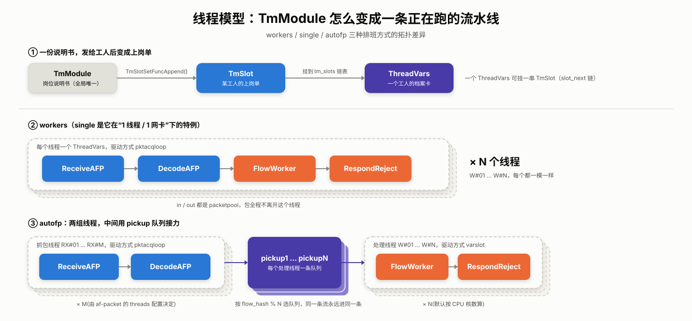

# 一条流水线是怎么跑起来的：线程模型与 TmModule

> 这是系列第 2 篇。上一篇跟着 `main()` 把 Suricata 送到了 `RunModeDispatch()` 门口——知道这一刻车间会正式开工，但没细看工位是怎么焊到工人身上的。这一篇就停在这个点往下拆：`TmModule` 怎么变成一个线程真正在跑的东西？一个包在同一个线程里怎么连续闯过好几道工位？single、autofp、workers 这三种排班方式，差别到底落在哪一行代码上？

## 1. 两个新角色：工人档案和上岗单

上一篇留了两个概念没拆开：`TmModule` 是工位的抽象，`RunMode` 决定工位怎么分给工人。真正把两者接起来跑起来的，还差两个没登场的角色：

- **`ThreadVars`**(`src/threadvars.h:59`)：一个工人的档案卡。线程名字、CPU 亲和性、运行标志位、正在干哪些工位……全记在这上面。它在整个线程存活期间只有一份，是 `pthread_create()` 真正传进去的那个东西。
- **`TmSlot`**(`src/tm-threads.h:53`)：工位说明书发到某个工人手上后生成的"上岗单"。`TmModule` 本身是全局唯一的一份说明书(存在 `tmm_modules[TMM_SIZE]` 数组里)，但同一份说明书可以抄发给好几个工人;`TmSlot` 就是抄给某一个工人的那一份，带着这个工人自己的运行数据(`slot_data`)。

关系可以这样理清：**TmModule 是岗位说明书，ThreadVars 是工人档案，TmSlot 是说明书发给某个工人之后生成的上岗单**。一个 `ThreadVars` 可以攥着一串 `TmSlot`(靠 `slot_next` 链起来)，这就是"一个线程连续干好几道工位"的由来。

## 2. TmModule：说明书上写的两种干活方式

回到 `TmModule` 的定义(`src/tm-modules.h:47`)，挑关键字段看：

```c
typedef struct TmModule_ {
    const char *name;
    TmEcode (*ThreadInit)(ThreadVars *, const void *, void **);
    TmEcode (*Func)(ThreadVars *, Packet *, void *);
    TmEcode (*PktAcqLoop)(ThreadVars *, void *, void *);
    TmEcode (*ThreadDeinit)(ThreadVars *, void *);
    ...
} TmModule;
```

`Func` 和 `PktAcqLoop` 是两种性质不同的"干活方式"：

- 多数工位是"来一个包处理一个包"的 `Func`，比如 `Decode`、`StreamTcp`、`Detect`——包递过来才干活，干完就把控制权交回去。
- 只有站在流水线最前端、负责从网卡或 pcap 里"生产"包的工位(比如 `ReceiveAFP`)才用 `PktAcqLoop`——它自己就是一个不停抓包的循环，不是被动等包递过来，而是主动去外面"造"包。

这个区分不是细节，它决定了挂着这个工位的线程要用哪种方式驱动起来，第 5 节会看到具体分支。

## 3. 上岗：说明书怎么发给工人，还串成一条线

工位说明书是死的，得有人把它发给具体的工人，还要把好几个工位串成一条线。这活是 `TmSlotSetFuncAppend()`(`src/tm-threads.c:658`)干的：

```c
void TmSlotSetFuncAppend(ThreadVars *tv, TmModule *tm, const void *data)
{
    TmSlot *slot = SCCalloc(1, sizeof(TmSlot));
    ...
    if (tm->Func) {
        slot->SlotFunc = tm->Func;
    } else if (tm->PktAcqLoop) {
        slot->PktAcqLoop = tm->PktAcqLoop;
    }
    ...
    if (tv->tm_slots == NULL) {
        tv->tm_slots = slot;
    } else {
        // 找到链表末尾,把新 slot 接上去
        ...
        b->slot_next = slot;
    }
}
```

逻辑很直白：每调用一次，就把一个 `TmModule` 拷贝成一份 `TmSlot`，挂到这个 `ThreadVars` 的 `tm_slots` 链表尾部。谁调用它、调用几次、传哪些 `TmModule`，就决定了这个线程身上串了哪几道工位、按什么顺序串。第 5 节看 RunMode 代码时会看到，"workers"模式其实就是对着一个新建的 `ThreadVars` 连续调用四次 `TmSlotSetFuncAppend`(`ReceiveAFP`、`DecodeAFP`、`FlowWorker`、`RespondReject`)。

## 4. 一个包，在一个线程里怎么连续闯过好几道工位

`tm_slots` 链表建好之后，包是怎么顺着它走的？答案在 `TmThreadsSlotVarRun()`(`src/tm-threads.c:133`)：

```c
TmEcode TmThreadsSlotVarRun(ThreadVars *tv, Packet *p, TmSlot *slot)
{
    for (TmSlot *s = slot; s != NULL; s = s->slot_next) {
        TmEcode r = s->SlotFunc(tv, p, SC_ATOMIC_GET(s->slot_data));
        if (unlikely(r == TM_ECODE_FAILED)) {
            ...
            return TM_ECODE_FAILED;
        }
    }
    return TM_ECODE_OK;
}
```

就是一个 `for` 循环，顺着 `slot_next` 挨个调用 `SlotFunc`。没有排队，没有跨线程切换——同一个包，在同一个线程的调用栈上，被同一条函数链依次处理完。这是理解 workers 模式为什么快的关键：只要一个线程包揽了从解码到检测的全部工位，包就不需要在线程之间搬来搬去，也就没有队列锁、没有唤醒开销。

## 5. 三种排班方式，差别到底在哪一行

`00` 篇里说过，同样一条"捕获→解码→检测→输出"的逻辑链，可以让一个工人从头干到尾(workers)，也可以分两组工人接力(autofp)。落到源码里，两者的差别都很具体，集中在 `src/util-runmodes.c`：

**workers**：`RunModeSetLiveCaptureWorkersForDevice()`(`util-runmodes.c:245`)给*每一个*线程建一个 `ThreadVars`，连续调用四次 `TmSlotSetFuncAppend`：`ReceiveAFP → DecodeAFP → FlowWorker → RespondReject`，输入输出队列都是 `"packetpool"`——没有真正的队列，包从抓包到出结果全程待在同一个线程里，驱动方式是 `"pktacqloop"`(即 `TmThreadsSlotPktAcqLoop`, `tm-threads.c:310`)：线程自己在 `while` 里反复调用链头 `ReceiveAFP` 的 `PktAcqLoop`，抓到一个包就顺着 `slot_next` 交给后面的工位处理完。

**autofp**：`RunModeSetLiveCaptureAutoFp()`(`util-runmodes.c:85`)造了*两组*线程。第一组只干 `Receive + Decode` 两道工位，干完往几条叫 `pickup1`、`pickup2`……的队列(`Tmq`，定义见 `src/tm-queues.c`)里扔;第二组线程专职 `FlowWorker + RespondReject`，各自守着一条 `pickup` 队列，驱动方式是 `"varslot"`(即 `TmThreadsSlotVar`, `tm-threads.c:410`)：线程在 `while` 里反复调用 `tv->tmqh_in(tv)` 从自己的队列里取包，取到了才走 `slot_next` 链。两组线程之间靠队列传包，这就是上一篇说的"传送带"。

至于"single"模式，翻开 `RunModeSetLiveCaptureSingle()`(`util-runmodes.c:359`)会发现一个不算意外的真相：它调用的还是 `RunModeSetLiveCaptureWorkersForDevice()`，只是把线程数强行钉死成 1、并且只允许配一个网卡。**single 不是第三种拓扑，它就是 workers 模式在"只准一个工人、只准一个入口"限制下的特例**。

## 6. autofp 的传送带凭什么不把同一条流拆乱

两组线程之间用队列传包没错，但如果随便传，同一条 TCP 流的包散落到不同的检测线程里，`Flow`、`Stream` 这些依赖连续状态的模块就全乱了。这活交给了队列的"处理器"(`Tmqh`，定义见 `src/tm-queuehandlers.h:36`)：autofp 里 Receive 线程往外扔包时用的是 `"flow"` 处理器，默认调度函数是 `TmqhOutputFlowHash()`(`src/tmqh-flow.c:220`)：

```c
void TmqhOutputFlowHash(ThreadVars *tv, Packet *p)
{
    uint32_t qid;
    if (p->flags & PKT_WANTS_FLOW) {
        uint32_t hash = p->flow_hash;
        qid = hash % ctx->size;
    } else {
        qid = ctx->last++; // 没有 flow 信息的包,退化成轮询
    }
    ...
}
```

逻辑就一句话：用 `p->flow_hash` 对队列数取模决定去哪条 `pickup` 队列。同一条流的哈希值不会变，所以它产生的所有包永远落进同一条队列，也就永远由同一个 worker 线程处理——这才保证了 `Flow`、`Stream` 这些跨包状态不会被两个线程同时读写。

## 7. 一张图收尾



到这里，一条流水线是怎么被组装、怎么被驱动起来的，主线就走完了。下一篇往前挪一站，看流水线上第一道真正的工位：包是怎么从网卡或 pcap 文件里被抓出来的，`AF_PACKET`、`PCAP`、`NFQ` 抓到的原始字节，又是怎么变成 Suricata 内部那个远比想象中复杂的 `Packet` 结构体的。
