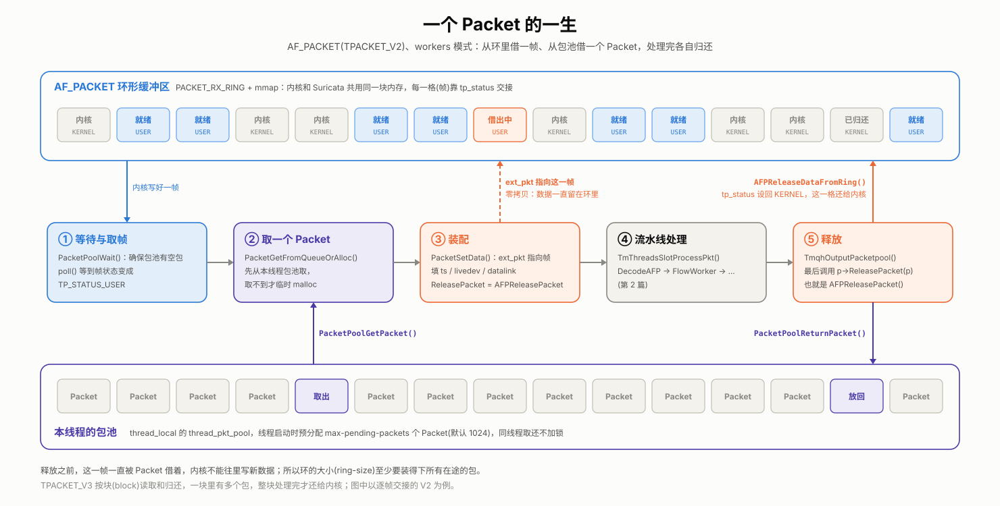

# Suricata 源码阅读(三)：包是怎么进来的——捕获模块与 Packet 结构体

> 这是系列第 3 篇。上一篇拆开了线程：workers 线程的链头是 `ReceiveAFP`，它用 `PktAcqLoop` 自己在循环里抓包，每抓到一个就交给后面的工位。这一篇钻进这个循环看：网卡上的字节是怎么到 Suricata 手里的？装它们的 `Packet` 长什么样？每秒几十万、上百万个包，Suricata 靠什么接得住？

先给答案，靠的是三件事：

1. **和内核共用一块内存。** AF_PACKET 的环形缓冲区同时映射在内核和 Suricata 进程里，包不用从内核拷贝到用户态。
2. **`Packet` 提前备好。** 每个线程启动时就预分配一批 `Packet`，放在自己的包池里反复复用，处理包的热路径上不做 malloc。
3. **从环里取包也不拷贝。** `Packet` 不另存一份数据，只存一个指针，指向环里的那一帧；处理完，再把这一帧还给内核。

这三件事串起来，就是一个 `Packet` 从借到还的一生：



下面先看 `Packet` 本身，再看包池，最后看 AF_PACKET 怎么和内核交接数据。

## 1. Packet：不只是一个结构体

`Packet` 定义在 `src/decode.h:509`，字段很多，挑出和本篇相关的，按原顺序列出来：

```c
typedef struct Packet_ {
    Address src;
    Address dst;
    ...                                /* 端口、协议号、VLAN、标志位等 */
    struct Flow_ *flow;                /* 所属的流(第 5 篇) */
    uint32_t flow_hash;
    SCTime_t ts;                       /* 抓包时间戳 */
    union {                            /* 各抓包后端的私有数据，同一时间只用一种 */
        NFQPacketVars nfq_v;
        AFPPacketVars afp_v;
        ...
        PcapPacketVars pcap_v;
    };
    void (*ReleasePacket)(struct Packet_ *);   /* 处理完之后，怎么"还" */
    ...
    struct PacketL2 l2;                /* 各层协议头的指针，解码时填(第 4 篇) */
    struct PacketL3 l3;
    struct PacketL4 l4;
    uint8_t *payload;
    uint16_t payload_len;
    ...
    uint32_t pktlen;                   /* 包数据的长度 */
    uint8_t *ext_pkt;                  /* 指向外部的包数据 */
    struct LiveDevice_ *livedev;       /* 从哪块网卡进来 */
    PacketAlerts alerts;               /* 命中的告警(第 8~10 篇) */
    ...
    struct PktPool_ *pool;             /* 从哪个包池借来的 */
    ...
    uint8_t pkt_data[];                /* 柔性数组：紧跟在结构体后面的包数据 */
} Packet;
```

之所以说它不只是一个普通结构体，是因为有四处设计值得单独拿出来说。

**第一，包数据有两个放法。** 结构体最后的 `pkt_data[]` 是一个柔性数组：分配 `Packet` 时多分配一段空间，包数据就紧跟在结构体后面，一次分配、内存连续。另一个放法是 `ext_pkt` 指针，指向结构体外面的某块内存。读数据时统一用宏 `GET_PKT_DATA(p)`(`src/decode.h:209`)：`ext_pkt` 为空就读 `pkt_data`，否则读 `ext_pkt`。

往里放数据的函数也有两个：

- `PacketCopyData()`(`src/decode.c:380`)：把数据拷进来。放得下就拷进 `pkt_data`；放不下，就单独 malloc 一块大内存挂到 `ext_pkt` 上。
- `PacketSetData()`(`src/decode.c:846`)：不拷贝，直接让 `ext_pkt` 指向外面的数据，并打上 `PKT_ZERO_COPY` 标志。

`pkt_data` 预留多大，由 `default_packet_size` 决定，一个 `Packet` 实际占 `sizeof(Packet) + default_packet_size` 字节(`SIZE_OF_PACKET`，`src/decode.h:712`)。没有配置 `default-packet-size` 时，用 pcap、netmap 这类方式从网卡抓包，默认取网卡的最大包长；读 pcap 文件等其他方式，默认是 1514(1500 字节 MTU 加 14 字节以太网头)。AF_PACKET 是个例外：只要没在配置里写 `default-packet-size`，它就一直是 0(`src/suricata.c:2562` 附近)。也就是说，AF_PACKET 模式下的 `Packet` 默认根本不预留数据空间，数据全靠 `ext_pkt` 指向环形缓冲区。

**第二，各抓包后端的私有数据放在一个 union 里。** AF_PACKET 要记住这个包来自环里的哪一帧，NFQ 要记住内核给的包 ID 以便下发裁决，pcap 又是别的东西。一个进程同一时间只用一种抓包方式，所以这些私有数据共用同一块空间。

**第三，`ReleasePacket` 是一个函数指针。** 包处理完之后怎么收尾，由把包送进来的那一方决定：AF_PACKET 要把环里那一帧还给内核，NFQ 要告诉内核放行还是丢弃，从包池借来的要还回包池，临时 malloc 的要 free。流水线末端只管调用 `p->ReleasePacket(p)`，不用关心包是从哪来的。

**第四，它是整条流水线共用的工作台。** 解码往 `l2`/`l3`/`l4` 里填各层协议头的指针，Flow 模块填 `flow`，检测往 `alerts` 里记告警，输出再从这些字段里取数据。一个包走完流水线，`Packet` 上就记满了各道工位留下的结果。后面几篇讲到的很多东西，都落在这个结构体的某个字段上。

## 2. 包池：提前备好的 Packet

如果每来一个包都 malloc 一个 `Packet`、处理完再 free，线速下内存分配本身就会成为瓶颈。Suricata 的办法是包池。

包池是线程局部的：`src/tmqh-packetpool.c:44` 定义了 `thread_local PktPool thread_pkt_pool;`，每个线程一个，互不干扰。线程启动时(上一篇说的初始化那一步，`src/tm-threads.c:217`)调用 `PacketPoolInit()`，一次性预分配 `max-pending-packets` 个 `Packet`，默认 1024 个(`src/suricata.c:169`)。每个 `Packet` 都记下自己属于哪个池(`p->pool`)，`ReleasePacket` 也设成了 `PacketPoolReturnPacket`。

**取**：`PacketPoolGetPacket()`(`src/tmqh-packetpool.c:118`)先从本线程的栈顶弹出一个，不用加锁。本地栈空了，才去加锁拿"归还栈"(`return_stack`)里别的线程还回来的包。

**还**：`PacketPoolReturnPacket()`(`src/tmqh-packetpool.c:168`)先看这个包属于谁。属于当前线程，就直接压回本地栈，不加锁。属于别的线程，通常先攒一批，攒够了再加锁、一次性挂到那个线程的归还栈上，并唤醒它。这正是上一篇 autofp 的情况：包由抓包线程分配，却在处理线程里用完。

**空了怎么办**：抓包循环每次读包之前，都会先调用 `PacketPoolWait()`(`src/tmqh-packetpool.c:71`)，源码里的注释写得很直白：确保包池里至少有一个包，免得在线速下 malloc。包池空了，抓包线程就在这里等别人把包还回来。万一真的取不到，`PacketGetFromQueueOrAlloc()`(`src/decode.c:296`)还有兜底：临时 malloc 一个，这种包的 `ReleasePacket` 是 `PacketFree`，用完直接释放。

## 3. AF_PACKET：和内核共用一块内存

包池解决了 `Packet` 从哪来，接下来是包数据从哪来。Linux 上最常用的抓包方式是 AF_PACKET，它的核心是一块内核和用户态共享的环形缓冲区。

**环形缓冲区是什么。** 可以把它想成一圈首尾相连的格子，格子数量固定。写的一方(内核)往前一格一格填包，读的一方(Suricata)跟在后面一格一格取，走到最后一格就绕回第一格，同一块内存反复使用，不用每次重新分配。每一格上有一个状态标记，写明它现在归谁：归内核的格子，内核可以往里写；归 Suricata 的格子，内核不会碰。双方各看各的标记，不需要加锁。

**为什么要用它。** 普通的原始 socket 每收一个包都要调用一次 `recvfrom()`，一次系统调用，外加一次从内核到用户态的拷贝。线速下每秒几十万、上百万个包，光这两样开销就吃不消。环形缓冲区是内核和 Suricata 共享的内存：只要环里有就绪的包，Suricata 直接读内存就行，不用系统调用，也不用拷贝；只有环里暂时没有新包时，才调用 `poll()` 睡下去等。

**环满了会怎样。** 如果 Suricata 处理得比包来得慢，就绪的格子越积越多，最终内核找不到空格子，只能把新到的包直接丢掉，并记在 socket 的统计里。Suricata 通过 `PACKET_STATISTICS` 把这个数取出来，计入 `capture.kernel_drops` 计数器(`src/source-af-packet.c:2638`)。所以在 `stats.log` 里看到 `capture.kernel_drops` 在涨，意思就是：环满了，包在进入 Suricata 之前就被内核丢掉了。

**建环。** `AFPCreateSocket()`(`src/source-af-packet.c:1942`)做了这么几件事：

1. `socket(AF_PACKET, SOCK_RAW, htons(ETH_P_ALL))` 创建一个原始套接字(第 1951 行)。
2. 用 `PACKET_VERSION` 选择 TPACKET_V2 或 V3 格式，再用 `PACKET_RX_RING` 让内核准备好接收环。
3. `mmap()` 把这块环映射到 Suricata 的地址空间(`src/source-af-packet.c:1829`)。从这以后，内核往环里写的包，Suricata 直接就能读到。
4. `bind()` 到指定网卡，再用 `PACKET_FANOUT` 加入一个 fanout 组(第 2050 行)。

有一个时机上的细节：这个 socket 不是在启动阶段创建的，而是在 `ReceiveAFPLoop()` 第一次运行时才创建，也就是线程被放行之后。这时主线程早已降过权，第 1 篇提到的"af-packet 模式保留 `CAP_NET_RAW`"，就是留给这一步用的。

**环里的交接。** 前面说的状态标记，落到代码里就是每一格(帧)头部的 `tp_status` 字段，内核和 Suricata 靠它交接：

- `TP_STATUS_KERNEL`：这一格归内核，内核可以往里写新包。
- `TP_STATUS_USER`：内核已经写好了一个包，这一格归 Suricata 读。

`AFPReadFromRing()`(`src/source-af-packet.c:887`)就是顺着环一格一格往下看：

```c
while (1) {
    h.raw = (((union thdr **)ptv->ring.v2)[ptv->frame_offset]);
    const unsigned int tp_status = h.h2->tp_status;
    if (unlikely(tp_status == TP_STATUS_KERNEL)) {
        break;                                  /* 这一格还归内核，没有新包了 */
    }
    ...
    Packet *p = PacketGetFromQueueOrAlloc();    /* 从包池借一个 Packet */
    AFPReadFromRingSetupPacket(ptv, h, tp_status, p);
    if (TmThreadsSlotProcessPkt(ptv->tv, ptv->slot, p) != TM_ECODE_OK) {
        ...
    }
next_frame:
    ++ptv->frame_offset;                        /* 走到下一格，到头就绕回 0 */
    ...
}
```

外面一层是 `ReceiveAFPLoop()`：先 `PacketPoolWait()`，再 `poll()` 等 socket 可读，有数据了就调用上面这个函数把就绪的帧一口气读完。

**多个线程怎么分包。** workers 模式下每个线程都有自己的 socket 和自己的环。同一块网卡的这些 socket 用同一个 `cluster-id` 加入同一个 fanout 组，由内核决定每个包交给哪个 socket。`cluster-type` 默认是 `cluster_flow`(`src/runmode-af-packet.c:346` 附近)，对应内核的 `PACKET_FANOUT_HASH`：按流的哈希值分发，同一条流的包总是进同一个 socket，也就是同一个 worker 线程。上一篇 autofp 在用户态用 `TmqhOutputFlowHash()` 做的事，workers 模式下交给内核在更早的地方做掉了。

**V2 和 V3。** 上面看的是 TPACKET_V2：一帧一个包，逐帧交接。TPACKET_V3 换成按块(block)交接，一块里装着多个包，`AFPReadFromRingV3()`(`src/source-af-packet.c:1059`)一次拿到一整块，逐个处理完块里的包，再把整块还给内核，内核交接的次数少得多。默认用哪个，由 `src/runmode-af-packet.c:311` 起的这段逻辑决定：

- 被动监听(IDS，不开 `copy-mode`)且没写 `tpacket-v3` 配置项时，默认启用 V3。
- 显式写了 `tpacket-v3: yes`，只有 workers 模式才会生效，其他模式会退回 V2。
- IPS 或 TAP 模式下用 V3，会收到一条"延迟会很高"的警告。

## 4. 零拷贝：借来的内存要还

读到一帧之后，`AFPReadFromRingSetupPacket()`(`src/source-af-packet.c:760`)负责把这一帧装配进 `Packet`，关键的几行是：

```c
p->livedev = ptv->livedev;
p->datalink = ptv->datalink;
...
(void)PacketSetData(p, (unsigned char *)h.raw + h.h2->tp_mac, h.h2->tp_snaplen);
p->ReleasePacket = AFPReleasePacket;
p->afp_v.relptr = h.raw;                        /* 记住是环里的哪一帧 */
...
p->ts = (SCTime_t){ .secs = h.h2->tp_sec, .usecs = h.h2->tp_nsec / 1000 };
```

`PacketSetData()` 让 `ext_pkt` 直接指向环里这一帧的数据，一个字节都不拷。代价是：在这个包被处理完之前，这一帧不能还给内核，它的 `tp_status` 一直停留在 `TP_STATUS_USER`，内核也就不能往这一格里写新包。

那什么时候还？答案在流水线的最末端。上一篇讲过，workers 线程的 `tmqh_out` 是 `TmqhOutputPacketpool()`，它在最后调用 `p->ReleasePacket(p)`(`src/tmqh-packetpool.c:403`)。对这个包来说，也就是 `AFPReleasePacket()`(`src/source-af-packet.c:720`)：

1. `AFPReleaseDataFromRing()`(`src/source-af-packet.c:687`)把 `relptr` 指向的那一帧的 `tp_status` 设回 `TP_STATUS_KERNEL`，这一格还给内核。如果开了 IPS 的 `copy-mode`，在归还之前还会先把这个包从另一块网卡转发出去；被判定丢弃的包不转发，拦截就是这样生效的。
2. `PacketFreeOrRelease()` 把 `Packet` 还回它所属的包池。

一借一还，环里的帧和池里的 `Packet` 都回到了原位，这就是开头那张图画的循环。

这也解释了配置里的一条约束：处理中的每个包都占着环里的一帧，所以环至少要装得下所有在途的包。如果 `ring-size` 乘以线程数还不到 `max-pending-packets`，Suricata 会发警告，并自动把 `ring-size` 调大(`src/runmode-af-packet.c:709` 附近)。

**别的抓包方式为什么要拷贝。** 零拷贝的前提是：数据所在的内存，在包处理完之前一直有效。并不是每种抓包方式都能保证这一点：

- **pcap**：libpcap 在回调函数返回后会复用自己的缓冲区，所以 `PcapCallbackLoop()` 用的是 `PacketCopyData()`(`src/source-pcap.c:347`)，老老实实拷一份。
- **NFQ**：源码里的注释说得很清楚，`nfq_get_payload()` 返回的内存在包的生命周期内不保证有效。只有 workers 模式下，包在回调里同步处理完，才敢零拷贝；否则一律拷贝(`src/source-nfq.c:463` 附近)。NFQ 的 `ReleasePacket` 是 `NFQReleasePacket()`，它负责向内核下发放行或丢弃的裁决，IPS 的"拦截"就是在这里真正生效的。

## 5. 交给下一站

包装配好之后，`TmThreadsSlotProcessPkt()` 把它交给链上的下一道工位 `DecodeAFP()`(`src/source-af-packet.c:2771`)。`DecodeAFP()` 根据 `p->datalink` 调用 `DecodeLinkLayer()`，从以太网头开始一层层往里剥，这是下一篇的内容。

## 小结

- `Packet` 是整条流水线共用的工作台。包数据要么放在末尾的柔性数组 `pkt_data[]` 里，要么由 `ext_pkt` 指向外面；各抓包后端的私有数据共用一个 union；处理完怎么收尾，由函数指针 `ReleasePacket` 决定。
- 每个线程有自己的包池，启动时预分配 `max-pending-packets` 个 `Packet`。同线程取还不加锁，跨线程归还才批量加锁。
- AF_PACKET 用 mmap 的环形缓冲区和内核共享内存，靠每一帧的 `tp_status` 交接；多个 worker 线程通过 fanout 由内核按流分包。
- 零拷贝让 `Packet` 直接指向环里的帧，代价是处理完之前这一帧不能还给内核；归还发生在流水线末端的 `ReleasePacket` 里。

下一篇接着往下走：`DecodeAFP()` 拿到的是一串从以太网头开始的原始字节，解码层怎么把它一层层剥成以太网、IP、TCP，又怎么应对畸形包和隧道？
