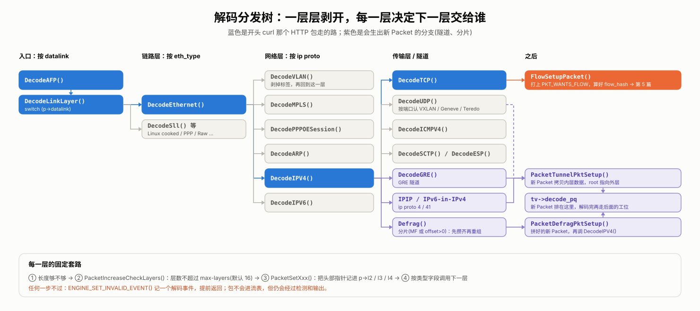

# Suricata 源码阅读(四)：把字节剥成协议——解码层

> 这是系列第 4 篇。上一篇结尾，包已经装进了 `Packet`，交给了链上的第二道工位 `DecodeAFP()`。但这时的 `Packet` 里只有一串从以太网头开始的原始字节，还不知道它是 IPv4 还是 IPv6，是 TCP 还是 UDP，源地址和端口是多少。这一篇看解码层怎么把这串字节一层层剥开，又怎么对付畸形包、隧道和分片。

先给答案，解码层做了三件事：

1. **一层层认出协议。** 每一层都看头部里"下一层是什么"的字段(以太网的 `eth_type`、IP 的协议号、有时是 UDP 端口)，决定下一层交给哪个解码函数。整个解码层就是一串层层嵌套的 `switch`。
2. **只记位置，不拷贝。** 解码不会把头部拷出来，只是把各层头部在原始数据里的位置记进 `Packet`，顺便填好地址、端口和载荷的位置。
3. **坏包留痕，不丢掉。** 遇到畸形包不崩溃、也不丢弃，而是记一个解码事件，照样往后送。遇到隧道和分片，则会生出新的 `Packet`。

整棵分发树画出来是这样的：



## 1. 入口：按链路类型分发

`DecodeAFP()`(`src/source-af-packet.c:2771`)本身很短：

```c
TmEcode DecodeAFP(ThreadVars *tv, Packet *p, void *data)
{
    const bool afp_vlan_hdr = p->vlan_idx != 0;
    DecodeThreadVars *dtv = (DecodeThreadVars *)data;

    DecodeUpdatePacketCounters(tv, dtv, p);           /* decoder.pkts、decoder.bytes 等计数 */
    DecodeLinkLayer(tv, dtv, p->datalink, p, GET_PKT_DATA(p), GET_PKT_LEN(p));
    if (afp_vlan_hdr) {
        ...
        UpdateRawDataForVLANHdr(p);                    /* 解码完，把内核剥掉的 VLAN 头补回原始数据 */
    }
    PacketDecodeFinalize(tv, dtv, p);
    SCReturnInt(TM_ECODE_OK);
}
```

`DecodeLinkLayer()`(`src/decode.h:1423`)按 `p->datalink` 分发。这个值是抓包时填的(上一篇 `AFPReadFromRingSetupPacket()` 里的 `p->datalink = ptv->datalink`)：普通以太网是 `LINKTYPE_ETHERNET`，交给 `DecodeEthernet()`；另外还有 Linux cooked 头、PPP、裸 IP 等几种，各有自己的解码函数。其他抓包方式的解码模块大同小异：`DecodePcap()` 同样调用 `DecodeLinkLayer()`；`DecodeNFQ()` 拿到的是不带链路层头的 IP 包，所以直接从 `DecodeIPV4()`/`DecodeIPV6()` 开始。

## 2. 每一层都是同一个套路

以 `DecodeEthernet()`(`src/decode-ethernet.c:42`)为例：

```c
int DecodeEthernet(ThreadVars *tv, DecodeThreadVars *dtv, Packet *p,
                   const uint8_t *pkt, uint32_t len)
{
    StatsIncr(tv, dtv->counter_eth);
    if (unlikely(len < ETHERNET_HEADER_LEN)) {                     /* ① 长度够不够 */
        ENGINE_SET_INVALID_EVENT(p, ETHERNET_PKT_TOO_SMALL);
        return TM_ECODE_FAILED;
    }
    if (!PacketIncreaseCheckLayers(p)) {                           /* ② 层数有没有超限 */
        return TM_ECODE_FAILED;
    }
    EthernetHdr *ethh = PacketSetEthernet(p, pkt);                 /* ③ 记下头部位置 */
    DecodeNetworkLayer(tv, dtv, SCNtohs(ethh->eth_type), p,        /* ④ 按类型交给下一层 */
            pkt + ETHERNET_HEADER_LEN, len - ETHERNET_HEADER_LEN);
    return TM_ECODE_OK;
}
```

几乎每一层解码函数都是这四步，读懂一个，其他的就好读了。

**① 长度够不够。** 先确认剩下的字节至少装得下这一层的头部。网络上的数据不可信，不检查就读，很容易越界。

**② 层数有没有超限。** `PacketIncreaseCheckLayers()`(`src/decode.h:1335`)把 `p->nb_decoded_layers` 加一，超过 `decoder.max-layers`(默认 16，`src/decode.h:1332`)就记一个 `decoder.too_many_layers` 事件并停下。VLAN 套 VLAN、隧道套隧道都会让层数增加，这道检查防止有人构造一个嵌套上百层的包，把解码器拖进无休止的递归。

**③ 记下头部位置。** `PacketSetEthernet()`(`src/decode.h:782`)只做了一件事：

```c
p->l2.type = PACKET_L2_ETHERNET;
p->l2.hdrs.ethh = (EthernetHdr *)buf;
```

它没有拷贝以太网头，只是把指向原始数据的指针存进 `p->l2`。IP 层存进 `p->l3`，TCP/UDP 存进 `p->l4`。上一篇说 `Packet` 是整条流水线的工作台，这就是解码往工作台上放的东西：后面的模块想读 TCP 头，直接顺着 `p->l4` 里的指针去原始数据里读。

**④ 按类型交给下一层。** `DecodeNetworkLayer()`(`src/decode.h:1460`)是一个按 `eth_type` 分发的 `switch`：`0x0800` 交给 `DecodeIPV4()`，`0x86DD` 交给 `DecodeIPV6()`，还有 VLAN、MPLS、PPPoE、ARP 等。VLAN 的解码函数剥掉 4 字节标签后，会再调用一次 `DecodeNetworkLayer()`，所以多层 VLAN 标签可以一层层剥下去。

## 3. IPv4：先过五道检查

`DecodeIPV4()`(`src/decode-ipv4.c:520`)先调用 `DecodeIPV4Packet()`(`src/decode-ipv4.c:473`)检查 IPv4 头：

```c
if (unlikely(len < IPV4_HEADER_LEN)) {                      /* 连最短的 IPv4 头都装不下 */
    ENGINE_SET_INVALID_EVENT(p, IPV4_PKT_TOO_SMALL);
    return NULL;
}
if (unlikely(IP_GET_RAW_VER(pkt) != 4)) {                    /* 版本号不是 4 */
    ENGINE_SET_INVALID_EVENT(p, IPV4_WRONG_IP_VER);
    return NULL;
}
const IPV4Hdr *ip4h = PacketSetIPV4(p, pkt);
if (unlikely(IPV4_GET_RAW_HLEN(ip4h) < IPV4_HEADER_LEN)) {   /* 头长字段比 20 字节还小 */
    ENGINE_SET_INVALID_EVENT(p, IPV4_HLEN_TOO_SMALL);
    return NULL;
}
if (unlikely(IPV4_GET_RAW_IPLEN(ip4h) < IPV4_GET_RAW_HLEN(ip4h))) {   /* 总长比头长还小 */
    ENGINE_SET_INVALID_EVENT(p, IPV4_IPLEN_SMALLER_THAN_HLEN);
    return NULL;
}
if (unlikely(len < IPV4_GET_RAW_IPLEN(ip4h))) {              /* 实际收到的比总长声明的少：被截断了 */
    ENGINE_SET_INVALID_EVENT(p, IPV4_TRUNC_PKT);
    return NULL;
}
SET_IPV4_SRC_ADDR(ip4h, &p->src);
SET_IPV4_DST_ADDR(ip4h, &p->dst);
```

五道检查都过了，才把源、目的地址填进 `p->src`、`p->dst`；如果有 IP 选项，再逐个解析。每一道检查对应一种真实存在的畸形包，攻击者也常用这类包来试探检测引擎的边界。

检查通过后，`DecodeIPV4()` 先看是不是分片(后面第 6 节讲)，不是的话，就按协议号分发：

```c
switch (p->proto) {
    case IPPROTO_TCP:  DecodeTCP(tv, dtv, p, data, data_len);    break;
    case IPPROTO_UDP:  DecodeUDP(tv, dtv, p, data, data_len);    break;
    case IPPROTO_ICMP: DecodeICMPV4(tv, dtv, p, data, data_len); break;
    case IPPROTO_GRE:  DecodeGRE(tv, dtv, p, data, data_len);    break;
    ...
    case IPPROTO_IPIP: {                                /* IP 里套 IP：隧道 */
        Packet *tp = PacketTunnelPktSetup(tv, dtv, p, data, data_len, DECODE_TUNNEL_IPV4);
        ...
    }
}
```

## 4. TCP：最后一层，也是交接点

`DecodeTCPPacket()`(`src/decode-tcp.c:217`)的检查项少一些：长度够不够、头长字段合不合理、选项长度有没有超出上限。之后解析 TCP 选项(MSS、窗口扩大、SACK、时间戳等)，再填好几样后面要用的东西：

```c
p->sp = TCP_GET_RAW_SRC_PORT(tcph);
p->dp = TCP_GET_RAW_DST_PORT(tcph);
p->proto = IPPROTO_TCP;
p->payload = (uint8_t *)pkt + hlen;      /* 载荷：TCP 头之后的位置，同样只是一个指针 */
p->payload_len = len - hlen;
```

到这里，五元组(源地址、目的地址、源端口、目的端口、协议)就齐了。`DecodeTCP()`(`src/decode-tcp.c:273`)最后一步是调用 `FlowSetupPacket()`(`src/flow-hash.c:548`)：

```c
void FlowSetupPacket(Packet *p)
{
    p->flags |= PKT_WANTS_FLOW;
    p->flow_hash = FlowGetHash(p);
}
```

它给包打上"需要找流"的标记，并按五元组算好哈希值。这是解码层交给下一站的接头暗号：`FlowWorker` 只处理带 `PKT_WANTS_FLOW` 的包，拿着 `flow_hash` 去流表里找对应的 `Flow`，这是下一篇的内容。autofp 模式下，抓包线程也是用这个 `flow_hash` 决定把包分给哪个处理线程的(第 2 篇)。

有一件事解码层**没有做**：计算 TCP 校验和。算校验和要把整个包加一遍，代价不小，而解码阶段并不需要它。真正用到时才算，比如 TCP 重组前的 `StreamTcpValidateChecksum()`(`src/stream-tcp.c:5884`)，算过一次的结果会存在 `p->l4.csum` 里。如果网卡做了校验和卸载(内核会在帧状态里标出 `TP_STATUS_CSUMNOTREADY`)，或者配置里关掉了 `checksum-checks`，抓包时就会给包打上 `PKT_IGNORE_CHECKSUM`，连这一步也省了(上一篇的 `AFPReadFromRingSetupPacket()` 里就有这段判断)。

## 5. 坏包：记下来，不丢掉

前面每一道检查失败时，都调用了 `ENGINE_SET_INVALID_EVENT()`(`src/decode.h:1203`)：

```c
#define ENGINE_SET_INVALID_EVENT(p, e) do { \
    p->flags |= PKT_IS_INVALID;             \
    ENGINE_SET_EVENT(p, e);                 \
} while(0)
```

`ENGINE_SET_EVENT()` 把事件编号追加到 `p->events` 里，`PKT_IS_INVALID` 标志则会让 `PacketDecodeFinalize()` 给 `decoder.invalid` 计数器加一。

注意，解码失败的包**并没有被丢掉**。解码函数只是提前返回，包照样交给后面的 `FlowWorker`。区别在于：它没走到 `FlowSetupPacket()`，没有 `PKT_WANTS_FLOW` 标志，所以不会进流表，也不会做 TCP 重组和应用层解析；但 `FlowWorker` 里的检测和输出对每个包都会执行。

这样设计，是因为对检测引擎来说，畸形包本身就是值得关注的信号：它可能是有人在试探、在构造绕过检测的包。所以解码事件有三个出口：

- **统计**：每种事件都有自己的计数器，比如 `decoder.event.ipv4.trunc_pkt`，在 `stats.log` 里就能看到哪种畸形包多。
- **规则**：Suricata 自带的 `rules/decoder-events.rules` 用 `decode-event` 关键字匹配这些事件，比如：

  ```text
  alert pkthdr any any -> any any (msg:"SURICATA IPv4 truncated packet"; decode-event:ipv4.trunc_pkt; classtype:protocol-command-decode; sid:2200003; rev:2;)
  ```

  加载这些规则后，截断的 IPv4 包就会产生一条告警；IPS 模式下，把 `alert` 改成 `drop`，就能直接丢掉这类包。
- **日志**：EVE 的 `anomaly` 事件类型可以把解码事件写进 `eve.json`。不过默认配置只记应用层异常，要在 `anomaly` 的 `types` 里打开 `decode: yes` 才会记解码事件。

## 6. 包里还有包：隧道和分片

有两种情况，解码层手里的这个包还不是全部：一种是包里还套着另一个包(隧道)，一种是一个包被拆成了好几片(分片)。两种情况的处理方式是一样的：生出一个新的 `Packet`。

**隧道。** Suricata 认隧道有两种方式：

- **按协议号**：GRE(47)、IP 套 IP(4)、IPv6 套 IPv4(41)，在 `DecodeIPV4()` 的 `switch` 里就能认出来。
- **按 UDP 端口**：VXLAN、Geneve、Teredo 跑在普通 UDP 上，只能靠端口判断。`DecodeUDP()` 会检查端口是否在配置的范围内(`src/decode-udp.c:88` 起)，是的话再按对应格式尝试解码。

认出隧道后，由 `PacketTunnelPktSetup()`(`src/decode.c:396`)生成内层包：

```c
Packet *p = PacketGetFromQueueOrAlloc();          /* 从包池再借一个 Packet */
PacketCopyData(p, pkt, len);                      /* 内层数据拷贝进来 */
p->recursion_level = parent->recursion_level + 1;
...
p->root = parent->root ? parent->root : parent;   /* root 指向最外层的那个包 */
p->ttype = PacketTunnelChild;
ret = DecodeTunnel(tv, dtv, p, GET_PKT_DATA(p), GET_PKT_LEN(p), proto);   /* 立刻解码内层 */
...
DecodeSetNoPayloadInspectionFlag(parent);        /* 外层包不再检查载荷 */
```

几个细节：

- 内层包用的是 `PacketCopyData()`，要拷贝一次。它不能像上一篇的零拷贝那样指向环形缓冲区，因为外层包处理完就会归还那一帧，内层包的生命周期却可能更长。
- 内层包的 `root` 指向最外层的包，`recursion_level` 加一。流表查找时会把 `recursion_level` 算进去，所以隧道内外的同名连接不会被混成一条流。
- 外层包被打上 `PKT_NOPAYLOAD_INSPECTION`：它的载荷就是内层包，内容检测交给内层包去做，免得同样的内容被检查两遍。
- 最外层的包要等所有内层包都处理完，才能真正归还。`TmqhOutputPacketpool()` 里专门有一段处理这种父子关系的代码。

生成的内层包被放进 `tv->decode_pq`，然后外层包继续往下走。那内层包什么时候处理？第 2 篇的 `TmThreadsSlotVarRun()` 里省略过一个细节：每走完一个解码模块，它都会检查 `decode_pq`，调用 `TmThreadsProcessDecodePseudoPackets()`(`src/tm-threads.c:114`)，把排在里面的新包逐个送进后面的工位。所以内层包和外层包在同一个线程里、紧挨着被处理。

**分片。** IPv4 头里的 MF 标志为 1，或者片偏移大于 0，说明这只是一个分片。`DecodeIPV4()` 把它交给 `Defrag()`(`src/defrag.c:1052`)：

```c
if (unlikely(IPV4_GET_RAW_FRAGOFFSET(ip4h) > 0 || IPV4_GET_RAW_FLAG_MF(ip4h))) {
    Packet *rp = Defrag(tv, dtv, p);
    if (rp != NULL) {
        PacketEnqueueNoLock(&tv->decode_pq, rp);
    }
    p->flags |= PKT_IS_FRAGMENT;
    return TM_ECODE_OK;
}
```

`Defrag()` 按源地址、目的地址、IP ID 和协议号，把属于同一个原始包的分片收集起来。还没收齐就返回空；收齐了，就用 `PacketDefragPktSetup()`(`src/decode.c:476`)生成一个重组好的新包，并立刻对它调用 `DecodeIPV4()`，从 IP 层重新解码一遍，最后同样放进 `decode_pq`。分片本身带着 `PKT_IS_FRAGMENT` 标志提前返回，没有走到 `FlowSetupPacket()`，不会进流表；进流表、做重组和检测内容的，是那个拼好的新包。

收集分片用的表是所有线程共享的(按行加锁)，所以即使同一个包的分片落在不同线程，也能拼到一起。但这会带来另一个问题：上一篇 AF_PACKET 的 `cluster_flow` 按五元组分发，而除了第一片，后面的分片里没有端口号，算出来的哈希不同，会被分到别的线程，同一条流的包就不再落在同一个线程里了。这就是 Suricata 建议在 `cluster_flow` 下打开 fanout `defrag` 选项的原因：让内核在分发之前先把分片拼好，拼好的包带着完整的五元组，还能分到它该去的线程。

## 小结

- 解码层是一串层层嵌套的 `switch`：链路层按 `datalink`，以太网按 `eth_type`，IP 按协议号，隧道有时还要按 UDP 端口。
- 每一层都是同一个套路：检查长度 → 检查层数 → 把头部指针记进 `p->l2`/`l3`/`l4` → 交给下一层。解码只记位置，不拷贝头部。
- 解码到 TCP/UDP 时，五元组齐了，`FlowSetupPacket()` 打上 `PKT_WANTS_FLOW` 并算好 `flow_hash`，交给下一站。
- 畸形包不丢弃，而是记解码事件：进统计、可被 `decode-event` 规则匹配、写进 EVE 的 `anomaly`。它们不会进流表，但仍会经过检测和输出。
- 隧道和分片会生出新的 `Packet`，放进 `decode_pq`，在同一个线程里紧接着处理。

下一篇进入 `FlowWorker`：`Flow` 是怎么让 Suricata 记住一段通信的？流表怎么查找、什么时候过期、谁来回收？
