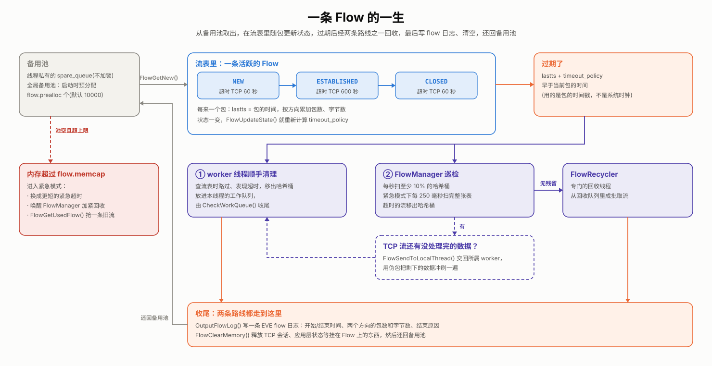

# Suricata 源码阅读(五)：引擎开始记住事情——Flow

> 这是系列第 5 篇。上一篇结尾，解码层把包的五元组填好，用 `FlowSetupPacket()` 打上 `PKT_WANTS_FLOW` 并算好了 `flow_hash`，交给 `FlowWorker`。到这一步为止，每个包都是孤立的：Suricata 处理完一个包就忘了它。从这一篇开始，引擎要"记住"事情了：同一条连接的包要归到一起，TCP 重组、应用层解析、很多规则，都建立在这份记忆之上。

先给答案，`Flow` 这一层做了三件事：

1. **一张所有线程共用的哈希表。** 每条连接对应一个 `Flow`，存在全局的流表里，按哈希桶加锁。哈希的算法让一条连接两个方向的包算出同一个值，落进同一个桶。
2. **后面所有模块的挂钩。** TCP 会话、应用层解析状态、规则组缓存、流变量，都挂在 `Flow` 上。有了 `Flow`，后面的模块才有地方存跨包的状态。
3. **有借有还。** `Flow` 从备用池里取，一条连接一段时间没有动静就算过期，写一条 `flow` 日志、清空内存，再还回备用池。内存不够时，还有一套紧急模式。

一条 `Flow` 从创建到回收的全过程，画出来是这样的：



## 1. Flow 里装了什么

`Flow` 定义在 `src/flow.h:354`，挑出和本系列相关的字段：

```c
typedef struct Flow_ {
    FlowAddress src, dst;                /* 五元组：第一个包的源地址被当作客户端 */
    Port sp, dp;                         /* (实际定义在 union 里，ICMP 用 type/code) */
    uint8_t proto;
    uint8_t recursion_level;             /* 隧道层级，见第 4 篇 */
    uint16_t vlan_id[VLAN_MAX_LAYERS];
    ...
    FlowThreadId thread_id[2];           /* 哪个 worker 线程在处理这条流 */
    struct Flow_ *next;                  /* 同一个哈希桶里的下一条流 */
    uint32_t flow_hash;
    uint32_t timeout_policy;             /* 多久没动静算过期，随状态变化 */
    SCTime_t lastts;                     /* 最后一个包的时间 */
    FlowStateType flow_state;            /* NEW / ESTABLISHED / CLOSED / ... */
    uint32_t flags;
    ...
    SCMutex m;                           /* 每条流自己的锁 */
    void *protoctx;                      /* TCP 会话(TcpSession)，第 6 篇 */
    AppProto alproto;                    /* 识别出的应用层协议，第 7 篇 */
    ...
    void *alstate;                       /* 应用层解析状态，第 7 篇 */
    const struct SigGroupHead_ *sgh_toclient;   /* 缓存的规则组，第 9 篇 */
    const struct SigGroupHead_ *sgh_toserver;
    GenericVar *flowvar;                 /* 规则里 flowbits、flowvar 存的变量 */
    struct FlowBucket_ *fb;              /* 在哪个哈希桶里 */
    SCTime_t startts;                    /* 第一个包的时间 */
    uint32_t todstpktcnt, tosrcpktcnt;   /* 两个方向的包数、字节数 */
    uint64_t todstbytecnt, tosrcbytecnt;
    Storage storage[];                   /* 其他模块按需挂的扩展数据 */
} Flow;
```

可以看出，`Flow` 自己只管"这是哪条连接、现在什么状态、什么时候过期"，真正的协议状态都是挂上去的：`protoctx` 指向 TCP 会话，`alstate` 指向 HTTP、TLS 这类应用层解析器的状态。后面几篇讲的东西，大多存在这几个指针后面。

## 2. 查流表

`FlowWorker` 拿到一个带 `PKT_WANTS_FLOW` 的包，调用 `FlowHandlePacket()`(`src/flow.c:547`)，它只做一件事：调用 `FlowGetFlowFromHash()` 找到这个包的 `Flow`，挂到 `p->flow` 上。

**流表的结构。** 流表是一个全局数组 `flow_hash[]`，长度由 `flow.hash-size` 决定，默认 65536。每个元素是一个哈希桶(`FlowBucket`，`src/flow-hash.h:43`)，桶里是一条 `Flow` 链表，再加一把桶锁：

```c
typedef struct FlowBucket_ {
    Flow *head;        /* 这个桶里正在用的流 */
    Flow *evicted;     /* 已被移出、等 FlowManager 收走的流 */
    SCMutex m;         /* 桶锁(也可以编译成自旋锁) */
    ...
} FlowBucket;
```

所有 worker 线程共用这一张表。锁的粒度是一个桶，不同线程查不同的桶时互不干扰；而且桶锁只在查找、插入的那一小段时间里持有，找到流之后就释放了。

**两个方向算出同一个哈希。** `flow_hash` 是解码时由 `FlowGetHash()`(`src/flow-hash.c:200`)算好的：

```c
FlowHashKey4 fhk = { .pad[0] = 0 };
int ai = (p->src.addr_data32[0] > p->dst.addr_data32[0]);
fhk.addrs[1-ai] = p->src.addr_data32[0];         /* 两个地址按大小排好序 */
fhk.addrs[ai] = p->dst.addr_data32[0];
const int pi = (p->sp > p->dp);
fhk.ports[1-pi] = p->sp;                         /* 两个端口也按大小排好序 */
fhk.ports[pi] = p->dp;
fhk.proto = p->proto;
fhk.recur = p->recursion_level & g_recurlvl_mask;    /* 隧道层级 */
...
fhk.vlan_id[0] = p->vlan_id[0] & g_vlan_mask;        /* VLAN */
...
hash = hashword(fhk.u32, ARRAY_SIZE(fhk.u32), flow_config.hash_rand);
```

关键在于先把两个地址、两个端口各自按大小排好序，再参与计算。这样客户端发往服务器、服务器回给客户端的包，算出来的哈希完全一样，会落进同一个桶，找到同一个 `Flow`。

另外两个细节：

- `recur`、`vlan_id`、`livedev` 也参与计算，所以隧道内外、不同 VLAN、不同网卡上的同名连接，会被当成不同的流。第 1 篇里 `SuricataInit()` 读的 `vlan.use-for-tracking` 这类配置，改的就是这里的掩码。
- `hashword()` 的最后一个参数 `hash_rand` 是启动时生成的随机数。没有它，攻击者可以构造大量哈希值相同的连接，让它们挤进同一个桶，把链表拉得很长，拖慢每一次查找。

**在桶里找流。** `FlowGetFlowFromHash()`(`src/flow-hash.c:922`)的主体，简化后是这样：

```c
FlowBucket *fb = &flow_hash[hash % flow_config.hash_size];
FBLOCK_LOCK(fb);

if (fb->head == NULL) {                    /* 桶是空的：直接新建一条流 */
    f = FlowGetNew(tv, fls, p);
    fb->head = f;
    FlowInit(tv, f, p);
    FlowUpdateState(f, FLOW_STATE_NEW);
    ...
    FBLOCK_UNLOCK(fb);
    return f;
}

f = fb->head;
do {
    const bool our_flow = FlowCompare(f, p) != 0;
    if (our_flow || timeout_check) {
        FLOWLOCK_WRLOCK(f);
        if (timeout_check && FlowIsTimedOut(tv_id, f, p->ts, emerg)) {
            MoveToWorkQueue(tv, fls, fb, f, prev_f);   /* 顺路发现超时的流：移出桶 */
            ...
        } else if (our_flow) {
            ...
            FBLOCK_UNLOCK(fb);
            return f;                               /* 找到了：带着流锁返回 */
        }
        ...
    }
    ...
    if (next_f == NULL) {                       /* 走到链表尾也没找到：新建一条 */
        f = FlowGetNew(tv, fls, p);
        f->next = fb->head;
        fb->head = f;
        ...
    }
    f = next_f;
} while (f != NULL);
```

有几处值得留意：

- `FlowCompare()` 比较时同样不分方向，正向、反向的包都能认出是同一条流。
- 找到的 `Flow` 是带着锁返回的。接下来 `FlowWorker` 对这个包做重组、应用层解析、检测时，一直持有这把流锁，处理完才释放。
- 一边找，一边顺手清理。`timeout_check` 为真时，遍历中碰到的每条流都会检查是否超时，超时的直接移出桶，放进本线程的工作队列。为了不在每次查找时都做这件事，FlowManager 会给每个桶记一个 `next_ts`：桶里最早可能超时的时间。包的时间还没到这个时间，就不用检查。
- `TcpSessionPacketSsnReuse()` 处理端口复用：同一个五元组上出现了一条新的 TCP 连接(比如旧连接已经结束、又来了一个新的 SYN)，就把旧流换下来，新建一条。

## 3. 新流从哪来

`FlowGetNew()`(`src/flow-hash.c:708`)取一个新 `Flow` 时，按从便宜到昂贵的顺序尝试：

1. **本线程的备用队列**(`fls->spare_queue`)：线程私有，不用加锁。
2. **全局备用池**：本地队列空了，就调用 `FlowSpareSync()` 从全局备用池里成批拿一块回来。启动时会预分配 `flow.prealloc` 个 `Flow`(默认 10000)放进这个池子。
3. **新分配**：池子也空了，先检查内存上限 `flow.memcap`(默认配置里是 128 MiB)。没超，就 `FlowAlloc()` 分配一个新的。
4. **抢一条**：如果已经超了内存上限，就进入**紧急模式**：

   ```c
   if (!(FLOW_CHECK_MEMCAP(sizeof(Flow) + FlowStorageSize()))) {
       if (!(SC_ATOMIC_GET(flow_flags) & FLOW_EMERGENCY)) {
           SC_ATOMIC_OR(flow_flags, FLOW_EMERGENCY);
           FlowTimeoutsEmergency();          /* 换成更短的紧急超时 */
           FlowWakeupFlowManagerThread();    /* 叫醒 FlowManager 赶紧回收 */
       }
       f = FlowGetUsedFlow(tv, fls->dtv, p->ts);   /* 从现有的流里抢一条来用 */
       ...
   }
   ```

   抢都抢不到，这个包就没有 `Flow` 可用，`flow.memcap` 计数器加一。抢成功一次，`flow.get_used` 加一。在 `stats.log` 里看到这两个计数器在涨，说明流表的内存不够用了。

这和第 3 篇的包池是同一个思路：常用的对象提前备好、反复复用，线程私有的部分不加锁，不够了再去全局拿、再去分配。

## 4. 方向和状态

**谁是客户端。** 新建流时，`FlowInit()`(`src/flow-util.c:147`)把第一个包的源地址、源端口记成 `f->src`、`f->sp`，也就是把第一个包的发送方当作客户端。之后每个包进来，`FlowGetPacketDirection()`(`src/flow.c:285`)拿包的地址和端口跟流里记的比一比，判断是发往服务器(to_server)还是发回客户端(to_client)，记进 `p->flowflags`。规则里的 `flow:to_server`，判断的就是这个标志。

第一个包的发送方不一定真是客户端。比如 Suricata 启动时，某条 TCP 连接已经在进行中，它看到的第一个包可能是服务器回的 SYN/ACK。TCP 重组模块发现这种情况，会调用 `FlowSwap()`(`src/flow.c:245`)把方向翻过来(`src/stream-tcp.c:1333`)。

**流的状态。** `Flow` 有几种状态：`NEW`、`ESTABLISHED`、`CLOSED`，另外还有两种 bypass 状态，这里先不展开。状态由谁来推进，取决于协议：

- **UDP 等无连接协议**：两个方向都见过包，就算 `ESTABLISHED`(`FlowHandlePacketUpdate()`，`src/flow.c:408`)。
- **TCP**：由 TCP 重组模块根据握手和挥手来推进：三次握手完成算 `ESTABLISHED`，挥手的前半段也还算 `ESTABLISHED`，到了挥手的最后阶段(`LAST_ACK`、`TIME_WAIT`)或连接关闭才算 `CLOSED`(`src/stream-tcp.c:1009` 起，下一篇细讲)。

状态之所以重要，是因为它决定了超时时长。`FlowUpdateState()`(`src/flow.c:1181`)每次改状态，都会重新计算 `f->timeout_policy`。默认配置(`suricata.yaml` 的 `flow-timeouts`)里，TCP 的超时是这样的：

| 状态 | 正常 | 紧急模式 |
|---|---|---|
| new | 60 秒 | 5 秒 |
| established | 600 秒 | 100 秒 |
| closed | 60 秒 | 10 秒 |

UDP 和 ICMP 的 new、established 分别是 30 秒和 300 秒。可以看到，new 的超时比 established 短得多：握手迟迟没有下文的连接(比如扫描)，不会长时间占着内存。紧急模式下，所有超时都大幅缩短，好尽快腾出内存。

## 5. 过期和回收

**怎样算过期。** `FlowIsTimedOut()`(`src/flow-hash.c:864`)的判断很直白：`f->lastts`(最后一个包的时间)加上 `f->timeout_policy`，早于现在就算过期。这里的"现在"是包的时间戳，不是系统时钟。所以离线读 pcap 文件时，流同样会按 pcap 里的时间正常过期。

**两条回收路线。** 过期的流有两种被发现的方式：

1. **worker 线程顺手发现。** 第 2 节说过，查流表时会顺路检查超时，超时的流被移进本线程的工作队列。`FlowWorker` 处理完当前包后，由 `CheckWorkQueue()`(`src/flow-worker.c:155`)把它们收尾：写 `flow` 日志、清空内存，放回本线程的备用队列。
2. **FlowManager 定期巡检。** 很多流在过期之后，再也不会有同一个桶里的包来"路过"它，只能靠后台线程去找。FlowManager 线程(`src/flow-manager.c:818`)每秒扫描流表的一部分：至少 10% 的桶，流表内存占用越高，扫得越多，大约 10 秒能把整张表过一遍；紧急模式下则每 250 毫秒把整张表扫一遍。扫到超时的流，就移出桶，交给 FlowRecycler 线程。

FlowRecycler 线程收到流之后，由 `Recycler()`(`src/flow-manager.c:1081`)做三件事：

```c
static void Recycler(ThreadVars *tv, FlowRecyclerThreadData *ftd, Flow *f)
{
    FLOWLOCK_WRLOCK(f);
    (void)OutputFlowLog(tv, ftd->output_thread_data, f);   /* 写一条 flow 日志 */
    FlowEndCountersUpdate(tv, &ftd->fec, f);
    ...
    FlowClearMemory(f, f->protomap);                       /* 释放 TCP 会话、应用层状态等 */
    FLOWLOCK_UNLOCK(f);
}
```

处理完的流再成批还回全局备用池，等着下一次被取走。

这也解释了一个常见的现象：像 00 篇开头那样 `curl` 一次，`eve.json` 里的 `flow` 事件总是比 `http` 事件晚出现。因为 `flow` 日志是在流过期、被回收时才写的，它记录的是这条连接从头到尾的汇总：开始和结束时间、两个方向的包数和字节数、结束的原因。

**还没检查完的数据怎么办。** TCP 流有一个特殊情况：过期时，重组缓冲区里可能还有一段数据没有交给应用层解析和检测，比如连接被突然切断、没有正常挥手。直接回收，这段数据就被漏掉了。所以 FlowManager 在把 TCP 流交给 FlowRecycler 之前，会先检查 `FlowNeedsReassembly()`。如果还有没处理的数据，就用 `FlowSendToLocalThread()`(`src/flow-timeout.c:349`)把这条流交回它所属的 worker 线程。worker 线程造几个伪包，沿着正常的流水线把剩下的数据冲刷一遍，做完重组、检测和输出，再回收这条流。worker 线程自己发现超时的流时，`CheckWorkQueue()` 里也有同样的处理。

## 小结

- `Flow` 存的是"这是哪条连接、现在什么状态、什么时候过期"；TCP 会话、应用层状态、规则组缓存都挂在它的指针上。
- 流表是一张所有线程共用的哈希表，按哈希桶加锁。哈希计算前先把地址和端口排序，两个方向的包落进同一个桶；随机种子 `hash_rand` 防止哈希碰撞攻击。
- 新流优先从线程私有的备用队列取，再从全局备用池取，最后才新分配；超过内存上限就进入紧急模式，缩短超时、抢用旧流。
- 第一个包的发送方被当作客户端，TCP 中途接管时会翻转方向；流的状态决定超时时长。
- 过期的流由 worker 线程顺手清理，或由 FlowManager 巡检发现、FlowRecycler 回收：写 `flow` 日志、清空内存、还回备用池。TCP 流回收前，会先把重组缓冲区里剩下的数据冲刷一遍。

下一篇进入 `Flow` 上挂着的第一样东西：TCP 会话。乱序、重传、重叠、丢包，TCP 重组模块怎么把一个个段拼成连续的字节流，又怎么防住专门用来绕过检测的手段？
